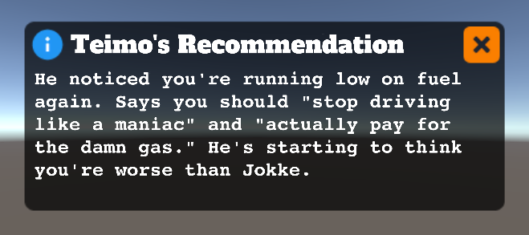

# NotificationAPI

  

This mod provides a simple and easy-to-use API for displaying pop-up notifications within My Summer Car. It allows other mods to display information, warnings, or errors to the player in a consistent and visually appealing manner.




## Features

  

*  **Easy Integration:** Provides a static `Notification` class with a simple `Notify` method for displaying notifications from other mods.

*  **Notification Types:** Supports three notification types: `Info`, `Warning`, and `Error`, each with a distinct icon.

*  **Persistence:** Allows notifications to be either persistent (stay on screen until dismissed) or temporary (disappear automatically after a set duration).

*  **Customizable:** Offers in-game settings to customize notification speed, duration, spacing, volume and whether to play sound alert.

*  **Queueing:** Manages multiple notifications, displaying them in a stack and ensuring that they don't overlap.

*  **Animation:** Uses smooth slide-in and slide-out animations for a polished user experience.

  

## Installation

  

1. Make sure you have [MSCLoader](https://github.com/piotrulos/MSCModLoader) installed.

2. Download the latest release of NotificationAPI from [Releases](https://github.com/RedJohn260/NotificationAPI/releases).

3. Extract the downloaded archive into the `Mods` folder in your My Summer Car installation directory (e.g., `My Summer Car/Mods`).

### Parameters

-   `NotificationManager.NotificationType type`: Specifies the type of notification. Can be one of:
    -   `NotificationManager.NotificationType.Info`: For general information.
    -   `NotificationManager.NotificationType.Warning`: For warnings or potential issues.
    -   `NotificationManager.NotificationType.Error`: For errors or critical issues.
-   `string title`: The title of the notification.
-   `string message`: The main content of the notification.
-   `bool persistent`: Determines whether the notification will remain on screen until the user closes it.
    -   `true`: The notification will stay until manually closed.
    -   `false`: The notification will automatically disappear after a short delay.
## Customization

The following settings can be adjusted in the Mod Settings menu within the game:

-   **Notification Speed:**  Controls the speed of the slide-in and slide-out animations.
-   **Notification Duration:**  Sets the duration (in seconds) for which non-persistent notifications are displayed.
-   **Notification Spacing:**  Adjusts the vertical spacing between stacked notifications.
-   **Play Notification Sound:**  Enable or disable sound notification.
-   **Notification Volume:**  Controls the volume for the notification sound.

## For Mod Developers

### Dependencies

Your mod needs to reference `NotificationAPI.dll` in the `Mods` folder, to access the NotificationAPI.

### Using the API

1.  Add a reference to the `NotificationAPI.dll` to your project.
2.  Include the  `NotificationAPI`  namespace in your script using  `using NotificationAPI;`.
3.  Check if `NotificationAPI` is present as mod.
4.  Call the  `Notification.Notify`  static method to display notifications:
```csharp

using  NotificationAPI; // Add this to the top of your script

  

// ... Inside your mod code ...

  

if (ModLoader.IsModPresent("NotificationAPI"))
{
    Notification.Notify(

    NotificationManager.NotificationType.Info, // The type of notification

    "Fuel Alert", // The title of the notification

    "Your fuel is running low!", // The message content

    false  // Whether the notification is persistent (true/false)

    );
}
```

### Example For Dynamic Values
```csharp
using System.Collections;
using UnityEngine;
using NotificationAPI; // Add this to the top of your MonoBehaviour script

  

// ... Inside your MonoBehaviour script code ...

private bool coroutineStarted = false;
private GameObject FuelTank; // FuelTank GameObject refrence.
private float previousFuelLevel; // Store the previous fuel level to detect changes

void Start()
{
    FuelTank = GameObject.Find("FuelTank"); // Get FuelTank GameObject.
    previousFuelLevel = FuelTank.fuelTankLevel; // Initialize previousFuelLevel at the start
}

void Update()
{
    // Check if fuel level is below the threshold
    if (FuelTank.fuelTankLevel <= 5f)
    {
        if (!coroutineStarted)
        {
            // Coroutine is not running, so start it
            StartCoroutine(LowFuelWarningCoroutine()); // Starts the low fuel warning coroutine
            coroutineStarted = true; // Set the flag to indicate the coroutine is running
        }
    }
    else
    {
        // Fuel level is above the threshold.  Check if it has changed.
        if (FuelTank.fuelTankLevel != previousFuelLevel)
        {
            // Resets the low fuel warning coroutine, stopping it if it's running and resetting the flag.
            if (coroutineStarted)
            {
                // Coroutine is running, so stop it
                StopCoroutine(LowFuelWarningCoroutine()); // Stops the low fuel warning coroutine
                coroutineStarted = false; // Reset the flag to allow the coroutine to be started again
            }
            previousFuelLevel = FuelTank.fuelTankLevel; // Update the previous fuel level
        }
    }
}

private IEnumerator LowFuelWarningCoroutine()
{
    Notification.Notify(

    NotificationManager.NotificationType.Info, // The type of notification

    "Fuel Alert", // The title of the notification

    "Your fuel is running low!", // The message content

    false  // Whether the notification is persistent (true/false)

    );
}

// Or you can make a custom event that fires up once fuel level is below the threshold

```
## Known Issues

-   None currently known. Please report any issues on the [GitHub issues page](https://github.com/RedJohn260/NotificationAPI/issues).
